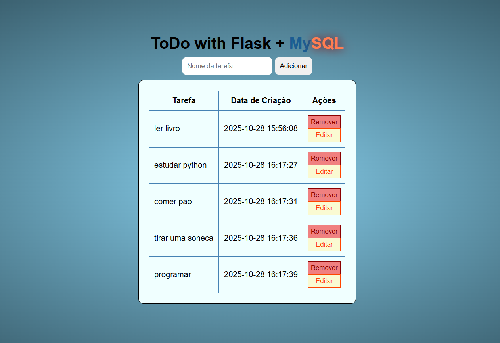

# Todo List Flask

Uma aplicação web para organização de tarefas construído com Flask e MySQL.
( Sem autenticação )



## Funcionalidades

- Criar tarefas
- Editar tarefas existentes
- Remover tarefas
- Limite máximo de 5 tarefas
- Notificações com fade out automático

## Tecnologias Utilizadas

- Python 3.x
- Flask
- MySQL (via XAMPP)
- HTML/CSS
- JavaScript

## Estrutura do Projeto

```
ToDoPessoal/
├── static/
│   ├── script.js
│   ├── style.css
│   └── print.png
├── templates/
│   ├── base.html
│   ├── edit.html
│   └── home.html
└── main.py
```

## Como Executar

1. Certifique-se de ter Python 3.x instalado
2. Instale as dependências:
```bash
pip install flask mysql-connector-python
```

3. Configure o MySQL via XAMPP:
   - Inicie o XAMPP e ative o MySQL
   - Host: localhost
   - Usuário: root
   - Senha: (vazia)
   - Database: todo_flask

4. Execute o aplicativo:
```bash
python main.py
```

5. Acesse http://localhost:5000 no navegador

## Limitações Conhecidas

⚠️ **Aviso**: Este aplicativo não está otimizado para dispositivos móveis. A interface atual é projetada apenas para desktop.

## Funcionalidades do Banco de Dados

- Tabela `tarefas`:
  - `id` (INT, AUTO_INCREMENT)
  - `nome_tarefa` (VARCHAR(100))
  - `data_criacao` (DATETIME)

## Features Implementadas

- [x] CRUD completo de tarefas
- [x] Validação de limite máximo
- [x] Flash messages com fade out
- [x] Confirmação de exclusão
- [ ] Responsividade mobile